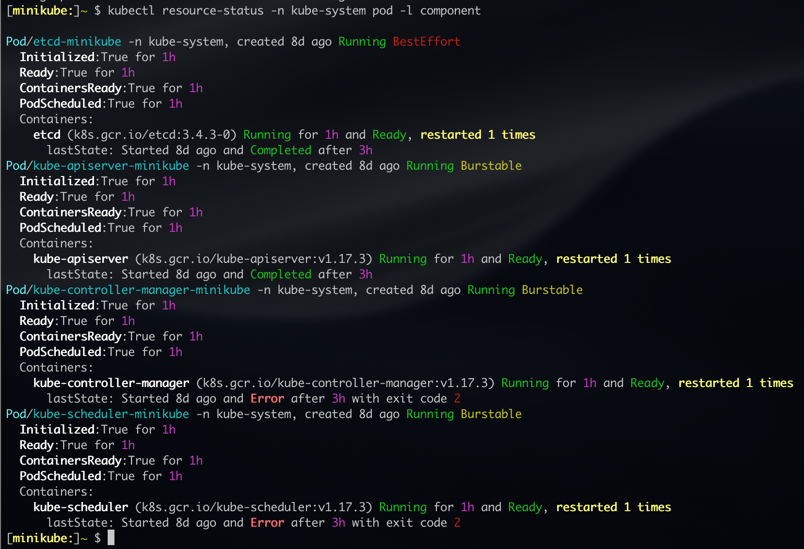
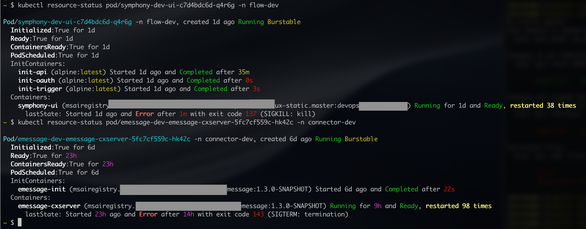
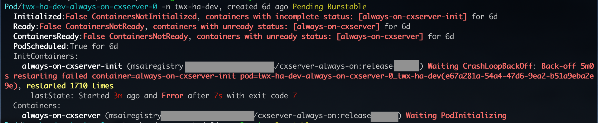
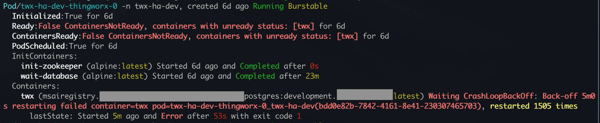

# status kubectl

A `kubectl` plugin to print a human-friendly output that focuses on
the status fields of the resources in kubernetes.

In most cases replacing a `kubectl get ...` with an `kubectl status ...`
would be sufficient.

## Quick Start

```
kubectl krew install status
kubectl status
```

See [usage](doc/USAGE.md) for some sample usage examples.

## Some Example Outputs

Sample pod output from a minikube instance:


Some pods got KILL and TERM signals, has containers with multiple restarts:


Some falinig InitContainer and Container



