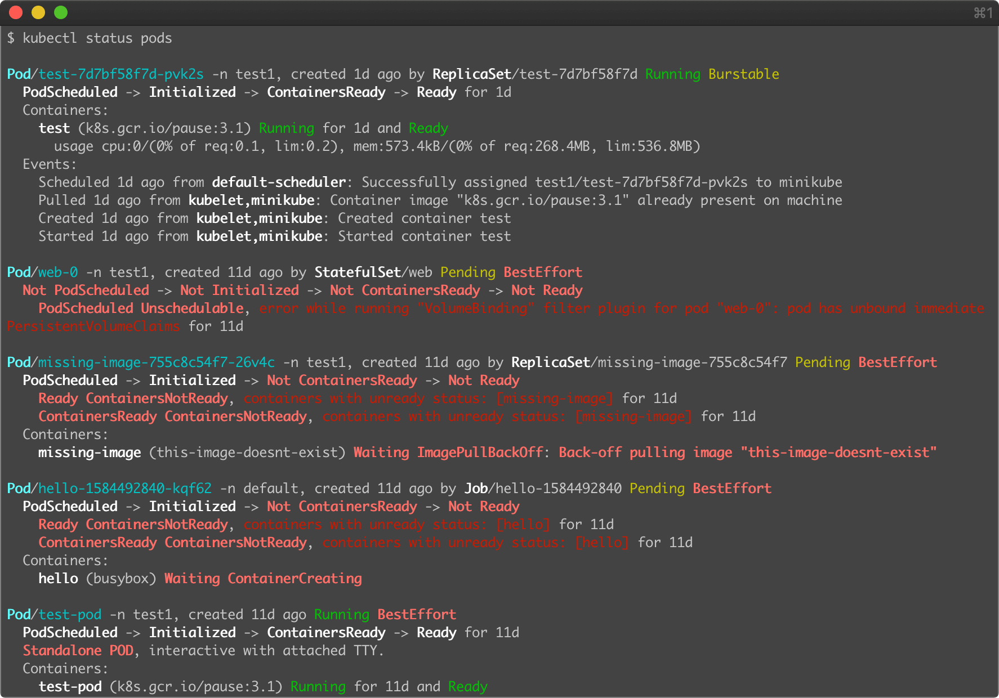
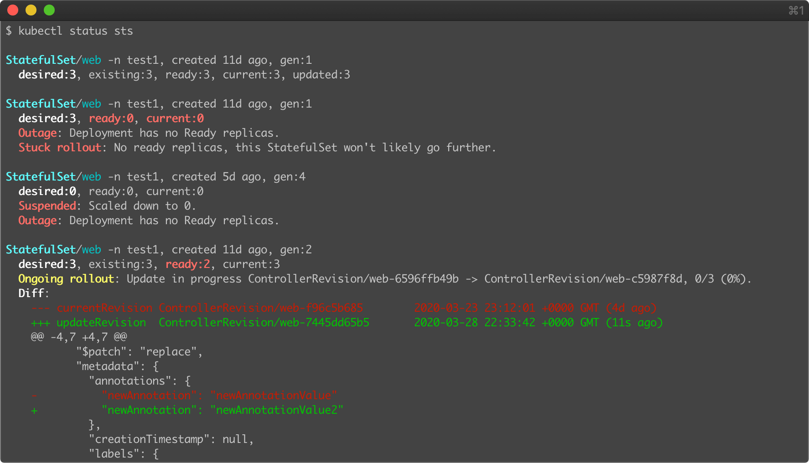
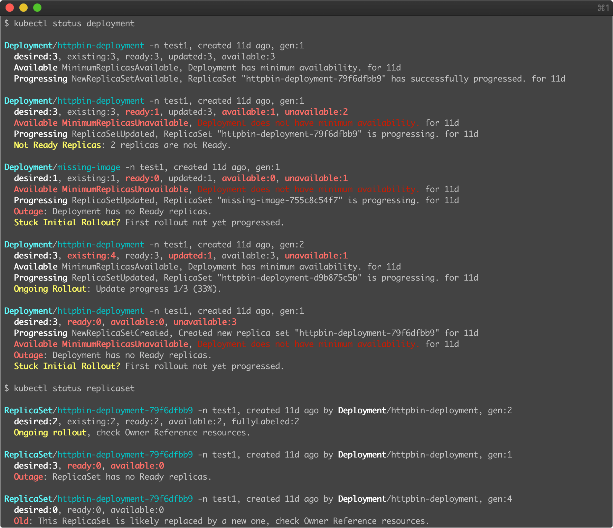
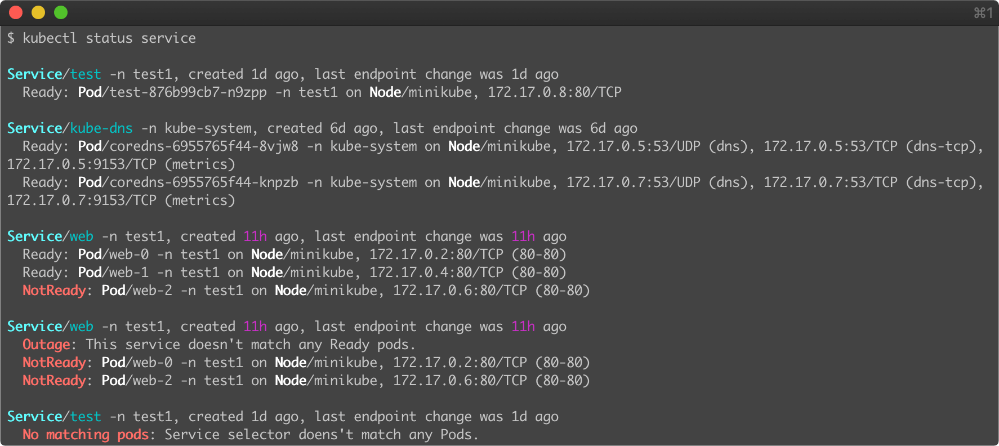

# kubectl status

A `kubectl` plugin to print a human-friendly output that focuses on the status fields of the resources in kubernetes.

Just a different representation of the kubernetes resources (next to `get` and `describe`).

This plugin uses templates for well-known API conventions and has support for hardcoded resources. Not all resources are
fully supported.

- [Installation](#installation)
    * [Upgrade](#upgrade)
- [Demo](#demo)
- [Features](#features)
- [Usage](#usage)
- [Development](#development)
    * [Guidelines](./CONTRIBUTING.md#general-guidelines)
- [License](#license)

## Installation

You can install `kubectl status` using the [Krew](https://github.com/kubernetes-sigs/krew), the package manager for
kubectl plugins.

After you [install Krew](https://krew.sigs.k8s.io/docs/user-guide/setup/install/), just run:

```bash
kubectl krew install status
kubectl status --help
```

### Upgrade

Assuming you installed using [Krew](https://github.com/kubernetes-sigs/krew):

```bash
kubectl krew upgrade status
```

## Demo

Example Pod:


Example StatefulSet:


Example Deployment and ReplicaSet


Example Service:


## Features

* aims for ease of understanding the status of a given resource,
* aligned with other kubectl cli subcommand usages (just like `kubectl get` or `kubectl describe`),
* uses colors extensively for a better look and feel experience, while a white-ish output means everything is ok,
  red-ish output strongly indicates something wrong,
* erroneous/impacting states are explicit and obvious,
* explicit messages for not-so-easy-to-understand status (e.g., ongoing rollout),
* goes the extra mile for better expressing the status (e.g., show spec diff for ongoing rollouts),
* compact, non-extensive output to keep it sharp,
* no external dependencies, doesn't shell out, and so doesn't depend on client/workstation configuration,
* optionally show absolute timestamps with `--absolute-time` for building timelines

## Usage

In most cases, replacing a `kubectl get ...` with a `kubectl status ...` would be sufficient.

Examples:

```bash
kubectl status pods                     # Show status of all pods in the current namespace
kubectl status pods --all-namespaces    # Show status of all pods in all namespaces
kubectl status deploy,sts               # Show status of all Deployments and StatefulSets in the current namespace
kubectl status nodes                    # Show status of all nodes
kubectl status pod my-pod1 my-pod2      # Show status of some pods
kubectl status pod/my-pod1 pod/my-pod2  # Same with previous
kubectl status svc/my-svc1 pod/my-pod2  # Show status of various resources
kubectl status deployment my-dep        # Show status of a particular deployment
kubectl status deployments.v1.apps      # Show deployments in the "v1" version of the "apps" API group.
kubectl status node -l node-role.kubernetes.io/master  # Show status of nodes marked as master
```

## Development

Please see [CONTRIBUTING.md](./CONTRIBUTING.md) file for development related documents.

## License

Apache 2.0. See [LICENSE](./LICENSE).
