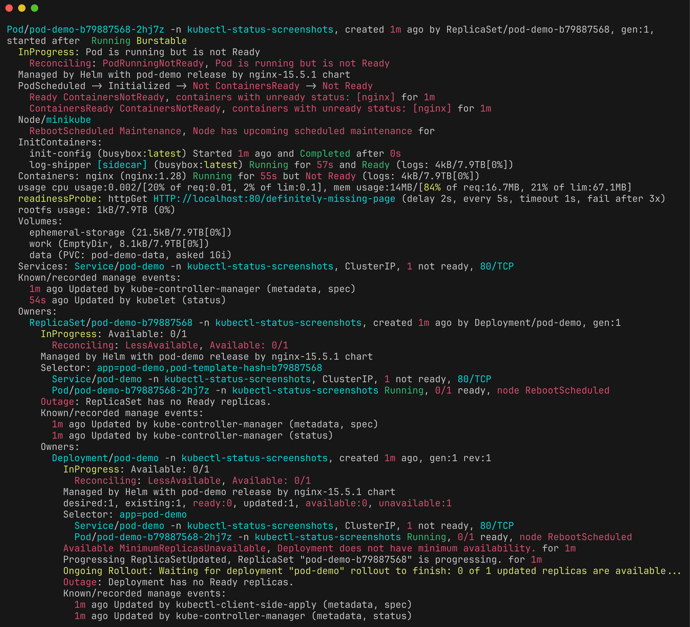
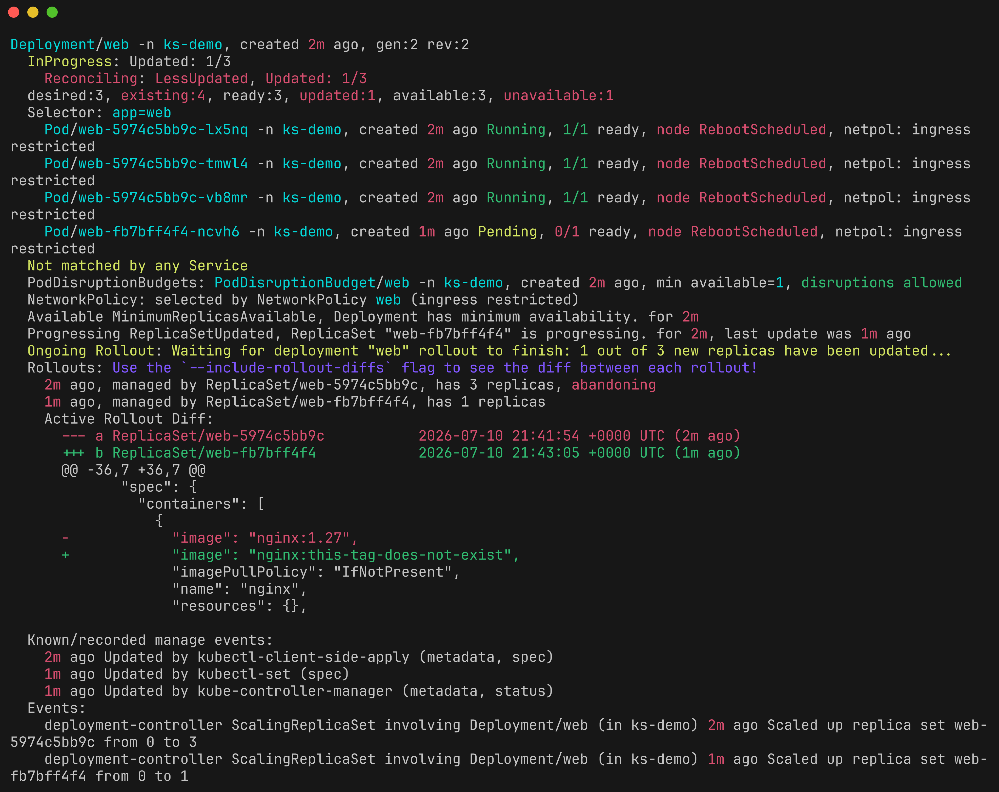
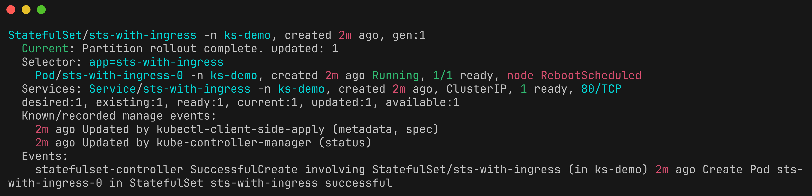
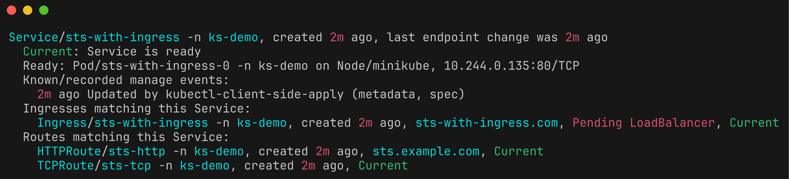
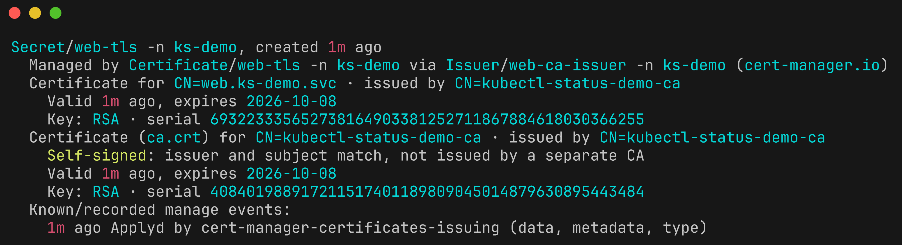

# kubectl status

Checking whether a Pod or Deployment is actually healthy usually means bouncing between `kubectl get`, `kubectl describe`,
`kubectl get pods -l ...`, and `kubectl describe pod ...` — then piecing the answer together yourself. `kubectl status`
gives you that answer in one familiar, drop-in command: same `kubectl` usage you already know, no new mental model,
read-only, no external dependencies.

Use it when `kubectl get` is too shallow and `kubectl describe` is too much.

- [Before and After](#before-and-after)
- [Demo](#demo)
- [Features](#features)
- [Installation](#installation)
    * [Upgrade](#upgrade)
- [Usage](#usage)
- [Scope and extending it](#scope-and-extending-it)
- [Development](#development)
    * [Conventions](./CONVENTIONS.md)
- [License](#license)

## Before and After

Instead of:

```bash
kubectl get deployment my-app
kubectl describe deployment my-app
kubectl get pods -l app=my-app
kubectl describe pod my-app-xxxxx
```

Run one command:

```bash
kubectl status deployment my-app
```

## Demo

Example Pod — a healthy Pod alongside a couple of unhealthy ones, and why:


Example Deployment and ReplicaSet — a stuck rollout (bad image) with its diff shown automatically,
plus the matching PodDisruptionBudget and NetworkPolicy:


Example StatefulSet:


Example Service — matching Ingress plus Gateway API HTTPRoute and TCPRoute:


Example Secret — a TLS certificate issued by a local cert-manager-generated CA:


## Features

* spot unhealthy or in-progress resources without hopping through multiple `kubectl` views,
* opinionated about what matters: e.g. a Service with no endpoints is called out as a likely outage instead of leaving
  you to infer it from raw fields,
* aligned with other kubectl cli subcommand usages (just like `kubectl get` or `kubectl describe`),
* colors carry meaning, not decoration: white-ish means everything is ok, red-ish strongly indicates something's wrong
  — and it's never color-only, the words say it too,
* explicit messages for not-so-easy-to-understand status (e.g., ongoing rollout),
* goes further where it's warranted (e.g., shows a spec diff for ongoing rollouts),
* compact, non-extensive output to keep it sharp,
* no external dependencies, doesn't shell out, and so doesn't depend on client/workstation configuration,
* optionally show absolute timestamps with `--absolute-time` for building timelines

## Installation

You can install `kubectl status` using the [Krew](https://github.com/kubernetes-sigs/krew), the package manager for
kubectl plugins.

After you [install Krew](https://krew.sigs.k8s.io/docs/user-guide/setup/install/), just run:

```bash
kubectl krew install status
kubectl status --help
```

### Upgrade

Assuming you installed using [Krew](https://github.com/kubernetes-sigs/krew):

```bash
kubectl krew upgrade status
```

## Usage

In most cases, replacing a `kubectl get ...` with a `kubectl status ...` is all it takes — one command instead of the
usual `get`/`describe` back-and-forth.

Examples:

```bash
kubectl status pods                     # Show status of all pods in the current namespace
kubectl status pods --all-namespaces    # Show status of all pods in all namespaces
kubectl status deploy,sts               # Show status of all Deployments and StatefulSets in the current namespace
kubectl status nodes                    # Show status of all nodes
kubectl status pod my-pod1 my-pod2      # Show status of some pods
kubectl status pod/my-pod1 pod/my-pod2  # Same with previous
kubectl status svc/my-svc1 pod/my-pod2  # Show status of various resources
kubectl status deployment my-dep        # Show status of a particular deployment
kubectl status deployments.v1.apps      # Show deployments in the "v1" version of the "apps" API group.
kubectl status node -l node-role.kubernetes.io/master  # Show status of nodes marked as master
```

## Scope and extending it

Out of the box, `kubectl status` has dedicated templates for ~40 resource kinds: core workloads (Pods, Deployments,
ReplicaSets, DaemonSets, StatefulSets, Jobs, CronJobs), Nodes, Services, Ingress, and more — plus Gateway API,
cert-manager, external-secrets, and Prometheus Operator resources. Anything without a template falls back to a
generic view.

For your own CRDs, drop a template into `~/.kubectl-status/templates/<Kind>.tmpl`, or let the paired
[Claude Code](https://claude.ai/code) skill (`/generate-template`) generate one from your CRD schema in seconds — see
[Claude Code Integration](./CONTRIBUTING.md#claude-code-integration) in CONTRIBUTING.md.

## Development

- [CONVENTIONS.md](./CONVENTIONS.md) — output philosophy, color rules, and template patterns
- [CONTRIBUTING.md](./CONTRIBUTING.md) — how to build, test, and submit changes

## License

Apache 2.0. See [LICENSE](./LICENSE).
