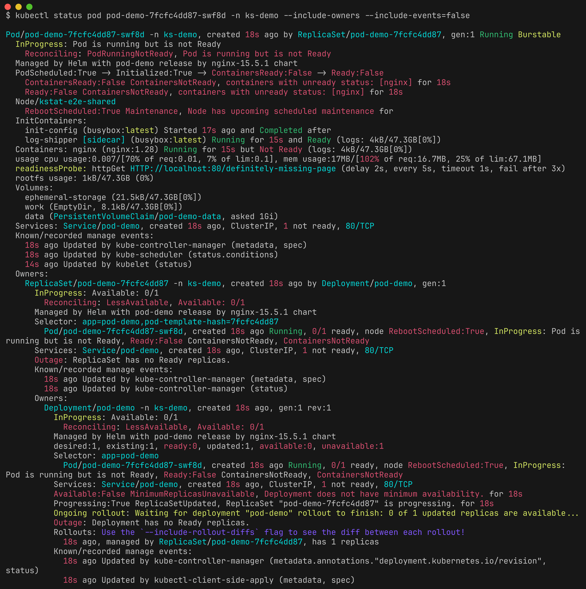
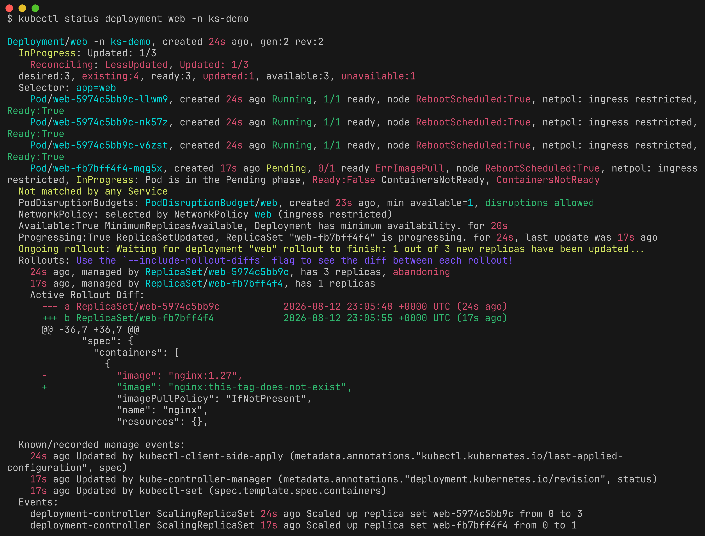
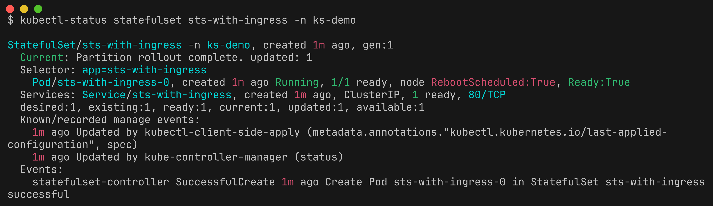
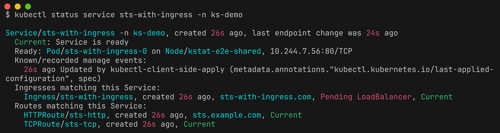
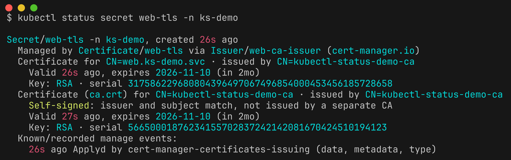

# kubectl status

[](https://www.bestpractices.dev/projects/5317)
[](https://www.bestpractices.dev/projects/5317)
[](https://codecov.io/gh/bergerx/kubectl-status)

Checking whether a Pod or Deployment is actually healthy usually means bouncing between `kubectl get`, `kubectl describe`,
`kubectl get pods -l ...`, and `kubectl describe pod ...` — then piecing the answer together yourself. `kubectl status`
gives you that answer in one familiar, drop-in command: same `kubectl` usage you already know, no new mental model,
read-only, no external dependencies.

Use it when `kubectl get` is too shallow and `kubectl describe` is too much.

- [Before and After](#before-and-after)
- [Demo](#demo)
- [Design principle](#design-principle)
- [Features](#features)
- [Installation](#installation)
    * [Upgrade](#upgrade)
- [Usage](#usage)
- [Scope and extending it](#scope-and-extending-it)
- [Development](#development)
    * [Architecture](./ARCHITECTURE.md)
    * [Conventions](./CONVENTIONS.md)
- [License](#license)

## Before and After

Instead of:

```bash
kubectl get deployment my-app
kubectl describe deployment my-app
kubectl get pods -l app=my-app
kubectl describe pod my-app-xxxxx
```

Run one command:

```bash
kubectl status deployment my-app
```

## Demo

Example Pod — a healthy Pod alongside a couple of unhealthy ones, and why:


Example Deployment and ReplicaSet — a stuck rollout (bad image) with its diff shown automatically,
plus the matching PodDisruptionBudget and NetworkPolicy:


Example StatefulSet:


Example Service — matching Ingress plus Gateway API HTTPRoute and TCPRoute:


Example Secret — a TLS certificate issued by a local cert-manager-generated CA:


## Design principle

`kubectl status` is a **health computation engine, not a formatter**: it derives "here's why this resource is unhealthy,
and which subordinate resources are at fault" mainly from the `status` fields Kubernetes already reports — not just a
re-shuffling of `kubectl get`/`describe` fields. Every template answers a question.

## Features

* spot unhealthy or in-progress resources without hopping through multiple `kubectl` views,
* opinionated about what matters: e.g. a Service with no endpoints is called out as a likely outage instead of leaving
  you to infer it from raw fields,
* aligned with other kubectl cli subcommand usages (just like `kubectl get` or `kubectl describe`),
* colors carry meaning, not decoration: white-ish means everything is ok, red-ish strongly indicates something's wrong
  — and it's never color-only, the words say it too,
* explicit messages for not-so-easy-to-understand status (e.g., ongoing rollout),
* goes further where it's warranted (e.g., shows a spec diff for ongoing rollouts, or names the
  specific Pod blocking a stuck StatefulSet rollback and the command to unstick it),
* compact, non-extensive output to keep it sharp,
* no external dependencies, doesn't shell out, and so doesn't depend on client/workstation configuration,
* optionally show absolute timestamps with `--absolute-time` for building timelines

## Installation

You can install `kubectl status` using the [Krew](https://github.com/kubernetes-sigs/krew), the package manager for
kubectl plugins.

After you [install Krew](https://krew.sigs.k8s.io/docs/user-guide/setup/install/), just run:

```bash
kubectl krew install status
kubectl status --help
```

### Upgrade

Assuming you installed using [Krew](https://github.com/kubernetes-sigs/krew):

```bash
kubectl krew upgrade status
```

## Verifying a release

Each release publishes signed artifacts and SBOMs. You can verify the integrity, authenticity, and signer identity of any release asset using `cosign` (keyless OIDC verification — no pre-shared keys).

### Artifacts per release

For version `vX.Y.Z`, the GitHub Release includes:

- `status_<OS>_<ARCH>.tar.gz` — the plugin binary archive
- `status_<OS>_<ARCH>.tar.gz.sig` — cosign signature of the archive
- `status_<OS>_<ARCH>.tar.gz.pem` — OIDC certificate used for signing
- `status_<OS>_<ARCH>.tar.gz.sbom.spdx.json` — SPDX SBOM
- `status_X.Y.Z_checksums.txt` — SHA-256 checksums of all archives
- `status_X.Y_Z_checksums.txt.sig` — cosign signature of the checksums file
- `status_X.Y_Z_checksums.txt.pem` — OIDC certificate for the checksums signature

### Verification steps

1. **Download the artifact and its verification files** (example for Linux amd64):

   ```bash
   VERSION=v0.7.24  # replace with desired version
   ARCH=status_linux_amd64.tar.gz
   BASE="https://github.com/bergerx/kubectl-status/releases/download/$VERSION"
   curl -LO "$BASE/$ARCH"
   curl -LO "$BASE/$ARCH.sig"
   curl -LO "$BASE/$ARCH.pem"
   curl -LO "$BASE/status_${VERSION#v}_checksums.txt"
   curl -LO "$BASE/status_${VERSION#v}_checksums.txt.sig"
   curl -LO "$BASE/status_${VERSION#v}_checksums.txt.pem"
   ```

2. **Verify the checksums file's signature and signer identity** (this confirms the release was built by our CI pipeline, not an attacker):

   ```bash
   cosign verify-blob \
     --certificate=status_${VERSION#v}_checksums.txt.pem \
     --signature=status_${VERSION#v}_checksums.txt.sig \
     --certificate-identity=https://github.com/bergerx/kubectl-status/.github/workflows/release.yml@refs/tags/$VERSION \
     --certificate-oidc-issuer=https://token.actions.githubusercontent.com \
     status_${VERSION#v}_checksums.txt
   ```

   Expected output: `Verified OK`

   - `--certificate-identity` pins the GitHub Actions workflow that produced the release (the `@refs/tags/$VERSION` suffix ensures only that exact tag's run is accepted).
   - `--certificate-oidc-issuer` pins GitHub's OIDC issuer.

3. **Verify the binary archive's checksum against the now-trusted checksums file**:

   ```bash
   sha256sum -c --ignore-missing status_${VERSION#v}_checksums.txt
   ```

   Expected output: `status_linux_amd64.tar.gz: OK`

4. **(Optional) Verify the binary archive's standalone signature** — same workflow identity, separate artifact:

   ```bash
   cosign verify-blob \
     --certificate=$ARCH.pem \
     --signature=$ARCH.sig \
     --certificate-identity=https://github.com/bergerx/kubectl-status/.github/workflows/release.yml@refs/tags/$VERSION \
     --certificate-oidc-issuer=https://token.actions.githubusercontent.com \
     $ARCH
   ```

### Verifying via Krew

If you install via `kubectl krew install/upgrade status`, Krew performs its own verification of the plugin manifest (`.krew.yaml`) against the krew-index repository, which is updated by our release pipeline after the GitHub Release is created. The steps above verify the *upstream* GitHub Release artifacts directly, independent of the krew-index supply chain.

### What this proves

| Criterion | What you verified |
|-----------|-------------------|
| **Integrity** (OSPS-DO-03.01) | The artifact's bytes match the checksums file, which was signed by the CI workflow. |
| **Authenticity** (OSPS-DO-03.01) | The checksums file was signed by a certificate issued to *our* release workflow at *that exact tag*. |
| **Signer identity** (OSPS-DO-03.02) | The certificate's `issuer` is GitHub Actions' OIDC provider, and its `subject` is the `release.yml` workflow at `refs/tags/vX.Y.Z` — not a compromised key or forked workflow. |

## Usage

In most cases, replacing a `kubectl get ...` with a `kubectl status ...` is all it takes — one command instead of the
usual `get`/`describe` back-and-forth.

Examples:

```bash
kubectl status pods                     # Show status of all pods in the current namespace
kubectl status pods --all-namespaces    # Show status of all pods in all namespaces
kubectl status deploy,sts               # Show status of all Deployments and StatefulSets in the current namespace
kubectl status nodes                    # Show status of all nodes
kubectl status pod my-pod1 my-pod2      # Show status of some pods
kubectl status pod/my-pod1 pod/my-pod2  # Same with previous
kubectl status svc/my-svc1 pod/my-pod2  # Show status of various resources
kubectl status deployment my-dep        # Show status of a particular deployment
kubectl status deployments.v1.apps      # Show deployments in the "v1" version of the "apps" API group.
kubectl status node -l node-role.kubernetes.io/master  # Show status of nodes marked as master
```

## Scope and extending it

Out of the box, `kubectl status` has dedicated templates for ~40 resource kinds: core workloads (Pods, Deployments,
ReplicaSets, DaemonSets, StatefulSets, Jobs, CronJobs), Nodes, Services, Ingress, and more — plus Gateway API, Istio,
cert-manager, external-secrets, and Prometheus Operator resources. Anything without a template falls back to a
generic view.

For your own CRDs, drop a template into `~/.kubectl-status/templates/<Kind>.tmpl`, or let the paired
[Claude Code](https://claude.ai/code) skill (`/generate-template`) generate one from your CRD schema in seconds — see
[Claude Code Integration](./CONTRIBUTING.md#claude-code-integration) in CONTRIBUTING.md. See
[TEMPLATE-API.md](./TEMPLATE-API.md) for the full list of shared template helpers and functions your
own template can safely depend on.

The [Kubernetes API conventions](https://github.com/kubernetes/community/blob/master/contributors/devel/sig-architecture/api-conventions.md#typical-status-properties)
recommend condition `type`s use the "abnormal-true" polarity (e.g. `status: "True"` means something's wrong), but
most built-in resources don't follow it — for those `kubectl status` treats `status: "True"` as healthy by default.
A known set of exceptions that do follow abnormal-true (like `DiskPressure` or `Failed`) is hardcoded. If your
cluster has CRDs with their own abnormal-true condition types, list them (one per line) in
`~/.kubectl-status/abnormal-true-condition-types` and they'll be treated the same way. Each line can be an exact
condition `type`, a suffix pattern like `*Problematic`, or a prefix pattern like `Unhealthy*`.

## Development

- [ARCHITECTURE.md](./ARCHITECTURE.md) — actors, actions, and data flow
- [CONVENTIONS.md](./CONVENTIONS.md) — output philosophy, color rules, and template patterns
- [TEMPLATE-API.md](./TEMPLATE-API.md) — the stable template/funcMap surface a custom `<Kind>.tmpl` can depend on
- [CONTRIBUTING.md](./CONTRIBUTING.md) — how to build, test, and submit changes
- [CHANGELOG.md](./CHANGELOG.md) — breaking changes to the template API

## License

Apache 2.0. See [LICENSE](./LICENSE).
